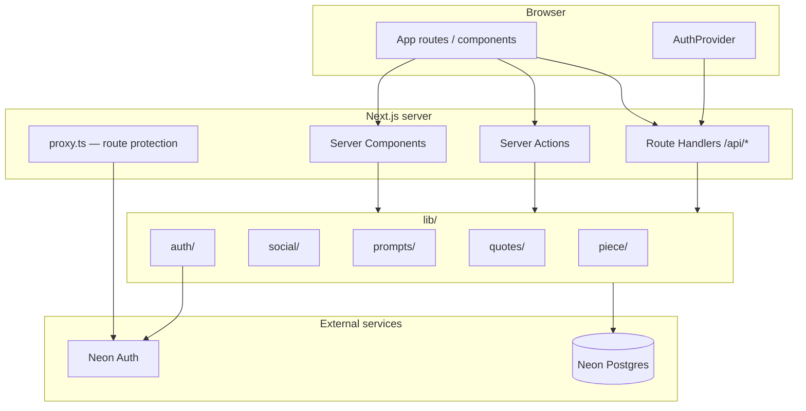

# Inkwell

Inkwell is a social creative-writing platform — a Poetizer-inspired MVP where writers publish poems, short stories, and essays, respond to weekly prompts, and connect through likes, comments, and follows.

Built with **Next.js 16** (App Router), **Neon Postgres**, **Neon Auth**, and **Prisma 7**.

---

## What it does

| Area | Description |
|------|-------------|
| **Home feed** | Featured piece, live prompt banner, recent public posts with inspirational quotes interspersed |
| **Write** | Rich composer for drafts and publishing; link work to an active prompt |
| **Read** | Reading room with progress, highlights, likes, comments, and “more from author” |
| **Browse** | Filter and explore published pieces by type |
| **Profiles** | Public writer pages with published work, liked pieces, follow/unfollow, and editable about section |
| **Prompts** | Weekly writing challenges with submission lists and a scoreboard of past prompts |
| **Admin** | Manage prompts and inspirational quotes (email allowlist) |

---

## Tech stack

| Layer | Choice |
|-------|--------|
| Framework | Next.js 16 App Router, React 19, TypeScript |
| Styling | Tailwind CSS 4, custom Inkwell theme (`app/inkwell-theme.css`) |
| Database | Neon Postgres via `@prisma/adapter-pg` |
| ORM | Prisma 7 (client generated to `lib/generated/prisma/`) |
| Auth | [Neon Auth](https://neon.tech/docs/neon-auth) (`@neondatabase/auth`) |
| Validation | Zod |
| UI primitives | Radix UI, shadcn-style components in `components/ui/` |
| Analytics | Vercel Analytics (production only) |

---

## Architecture

Inkwell follows a **layered Next.js App Router** pattern: Server Components fetch data, client components handle interactivity, and domain logic lives in `lib/` rather than in route files.



### Request flow (typical page)

1. **`proxy.ts`** intercepts protected routes (`/write`, `/profile`, `/admin/*`) and redirects unauthenticated users to `/sign-in`.
2. A **Server Component** in `app/` calls query functions from `lib/` (e.g. `listPublishedPieces`).
3. **Prisma** reads/writes Neon Postgres through the pg driver adapter in `lib/db.ts`.
4. Data is mapped to UI types (e.g. `pieceToFeedPost`) and passed to client components as props.
5. Mutations use **Server Actions** (`app/actions/`) or **Route Handlers** (`app/api/`) which call domain functions in `lib/`.

### Auth model

- **Neon Auth** handles sign-up, sign-in, sessions, password change, and account deletion.
- Auth API is mounted at `app/api/auth/[...path]/route.ts`.
- On sign-up, a **`Profile`** row is created in Postgres (`lib/auth/ensure-profile.ts`) with the same ID as the auth user.
- **`AuthProvider`** (`components/inkwell/auth-provider.tsx`) exposes session state client-side and checks admin status via `/api/auth/admin-status`.
- **Admin access** is controlled by the `INKWELL_ADMIN_EMAILS` env var — not a database role.

### Data access

- All database access goes through **`lib/db.ts`** → generated Prisma client.
- Query/mutation logic is grouped by domain:
  - `lib/piece/` — publish, update drafts, delete, queries
  - `lib/social/` — likes, comments, follows
  - `lib/prompts/` — prompt lifecycle, submissions, page loaders
  - `lib/quotes/` — quote of the day, feed snippets
  - `lib/profile/` — profile updates
- **Zod schemas** in `lib/validations/` validate inputs at boundaries.

---

## Project structure

```
app/                          # Routes (App Router)
  page.tsx                    # Home feed
  write/                      # Composer (auth required)
  read/[id]/                  # Reading room
  browse/                     # Browse by type
  prompts/                    # Prompt index
  prompt/[slug]/              # Single prompt + submissions
  profile/                    # Own profile + settings
  profile/[handle]/           # Public writer profile
  sign-in/ sign-up/           # Auth pages
  admin/                      # Admin hub, prompts, quotes
  actions/                    # Server Actions (auth, publish)
  api/                        # REST route handlers

components/inkwell/           # Product UI
  feed/                       # Home feed sections
  write/composer/             # Writing experience
  read/                       # Reading room
  profile/                    # Profile pages
  prompts/                    # Prompt UI
  admin/                      # Admin UI
  social/                     # Like, comment, follow buttons

lib/                          # Domain logic & data access
  piece/ prompts/ quotes/ social/ profile/ auth/ admin/
  feed/                       # Shared UI types + mock fallbacks
  seed/                       # Database seed scripts
  generated/prisma/           # Prisma client (generated)

prisma/schema.prisma          # Database schema
proxy.ts                      # Route protection (Next.js 16)
scripts/                      # Build, Prisma, env helpers
```

---

## Data model

Core entities in `prisma/schema.prisma`:

| Model | Purpose |
|-------|---------|
| **Profile** | Writer identity (handle, name, bio, about, follower counts) |
| **Piece** | Poem, story, or essay — draft or published, with visibility and optional prompt link |
| **PieceLike** | One like per profile per piece (delete row to unlike) |
| **PieceComment** | Comments on published pieces |
| **ProfileFollow** | Follow relationships with denormalized counts on Profile |
| **Prompt** | Weekly writing prompt (`ACTIVE`, `VOTING`, or `CLOSED`) |
| **Quote** | Inspirational quotes; one is featured each day |

**Piece visibility** supports `PUBLIC`, `FOLLOWERS`, and `PRIVATE`. Currently, read/browse/feed queries only surface **public** published pieces — followers-only work is saved but not yet readable by followers.

---

## How things work

### Sign-up and profiles

1. User submits the sign-up form → `signUpAction` validates with Zod.
2. Neon Auth creates the auth user; `ensureUserProfile` creates the linked `Profile`.
3. User is redirected to `/profile`.

Handles must be unique. Profile settings allow editing name, handle, bio, and about text.

### Writing and publishing

1. `/write` loads the user’s latest draft (or a specific draft via `?pieceId=`).
2. Optional `?prompt=` links the piece to an **active** prompt.
3. The composer saves via `publishPieceAction` → `lib/piece/publish.ts`:
   - **Draft** → `status: DRAFT`, `visibility: PRIVATE`
   - **Public publish** → `status: PUBLISHED`, `visibility: PUBLIC`
   - **Followers publish** → `status: PUBLISHED`, `visibility: FOLLOWERS`
4. One published submission per prompt per author is enforced.
5. **Drafts can be updated**; published pieces cannot be edited yet (`updatePiece` blocks non-draft edits).

### Home feed

`app/page.tsx` loads in parallel:

- Featured piece (highest like count among public published pieces)
- Recent public published pieces
- Live active prompt preview
- Quotes for interleaving into the feed

`InkwellFeed` filters client-side and intersperses quote callouts between posts.

### Reading and social

- `/read/[id]` loads a published public piece with author info, related work, like state, comments, and follow state.
- Likes and comments go through `/api/pieces/[id]/like` and `/api/pieces/[id]/comments`.
- Follow/unfollow uses `/api/profile/[handle]/follow`.
- Counts (`likeCount`, `commentCount`, `followerCount`) are denormalized on the parent row and updated in mutation handlers.

### Prompts

- Admins create prompts in `/admin/prompts`. Only one prompt should be **ACTIVE** at a time.
- `syncExpiredActivePrompts()` auto-closes active prompts past their `endsAt` deadline.
- Writers submit by publishing from `/write?prompt=<slug>` while the prompt is active.
- `/prompts` shows the live prompt and a scoreboard of past prompts with top submissions.

### Quotes

- Admins manage quotes at `/admin/quotes`.
- `getQuoteOfDay()` rotates through quotes by day index (`Date.now() / 86_400_000 % count`).
- The feed intersperses quote snippets between posts via `intersperseFeedQuotes`.

### Admin

- `/admin` layout calls `requireAdminPage()` — redirects to sign-in if logged out, returns 404 if not on the admin email list.
- Admin API routes use `authorizeAdminApi()` with the same email allowlist.

---

## Getting started

**Requirements:** Node.js ≥ 20.19 (see `.nvmrc`), a Neon project with Postgres and Auth enabled.

### 1. Install dependencies

```bash
npm install
```

Prisma client generation runs automatically on `postinstall`.

### 2. Configure environment

Copy the example env file and fill in your Neon credentials:

```bash
cp .env.example .env.local
```

See [Environment variables](#environment-variables) below.

### 3. Push schema and seed

```bash
npm run db:push
npm run db:seed
```

Seed data creates sample profiles, pieces, prompts, and quotes. Use `npm run db:seed:clear` to remove seeded rows.

### 4. Run the dev server

```bash
npm run dev
```

Open [http://localhost:3000](http://localhost:3000).

### 5. Production build

```bash
npm run build
npm start
```

The build requires a reachable `DATABASE_URL` — several pages fetch from Postgres at build time.

---

## Environment variables

| Variable | Required | Description |
|----------|----------|-------------|
| `DATABASE_URL` | Yes | Neon Postgres connection string (pooled, `sslmode=verify-full` recommended) |
| `NEON_AUTH_BASE_URL` | Yes | Neon Auth endpoint from Neon Console → Branch → Auth |
| `NEON_AUTH_COOKIE_SECRET` | Yes | Session cookie signing secret (`openssl rand -base64 32`) |
| `INKWELL_ADMIN_EMAILS` | No | Comma-separated admin emails for `/admin` access |
| `NEXT_PUBLIC_ANNOUNCEMENT` | No | Text for the top announcement bar |
| `NEXT_PUBLIC_ANNOUNCEMENT_LINK` | No | Optional link for the announcement bar |
| `CONTACT_WEBHOOK_URL` | No | Webhook for contact form submissions |

---

## Scripts

| Command | Description |
|---------|-------------|
| `npm run dev` | Start Next.js dev server |
| `npm run build` | Generate Prisma client + production build |
| `npm run start` | Start production server |
| `npm run db:generate` | Regenerate Prisma client |
| `npm run db:push` | Push schema to database |
| `npm run db:migrate` | Run Prisma migrations (dev) |
| `npm run db:studio` | Open Prisma Studio |
| `npm run db:seed` | Seed sample data |
| `npm run db:seed:clear` | Remove seeded data |

---

## API routes (overview)

| Route | Methods | Purpose |
|-------|---------|---------|
| `/api/auth/[...path]` | GET, POST | Neon Auth handler |
| `/api/auth/admin-status` | GET | Check if current user is admin |
| `/api/pieces` | GET, POST | List / create pieces |
| `/api/pieces/[id]` | GET, PATCH, DELETE | Read, update draft, delete |
| `/api/pieces/[id]/like` | POST, DELETE | Like / unlike |
| `/api/pieces/[id]/comments` | GET, POST | List / create comments |
| `/api/profile/[handle]/follow` | POST, DELETE | Follow / unfollow |
| `/api/admin/prompts` | GET, POST | Admin prompt CRUD |
| `/api/admin/quotes` | GET, POST | Admin quote CRUD |
| `/api/health/db` | GET | Database connectivity check |

---

## MVP notes

These are intentional gaps or placeholders in the current MVP — not bugs per se:

- **Followers-only visibility** is stored but not enforced on read paths yet.
- **Published piece editing** is disabled; only drafts can be updated.
- **Prompt voting** (`VOTING` status) exists in the schema/admin but has no user-facing vote flow.
- **Streak widgets** and some sidebar cards (`TrendingWriters`, `ReadersLovingGrid`) use static mock data.
- **Share counts** are displayed in the UI but not incremented by real share actions.
- **No automated test suite** yet.

---

## Deployment

Inkwell is designed for [Vercel](https://vercel.com) with Neon integrations:

1. Link the repo to a Vercel project.
2. Set environment variables in the Vercel dashboard (same as `.env.local`).
3. Ensure `DATABASE_URL` is available at build time.
4. Deploy — merges to `main` can auto-deploy if connected via v0.

Health check: `GET /api/health/db` returns database latency and status.

---

## License

Private project — all rights reserved unless otherwise specified.
